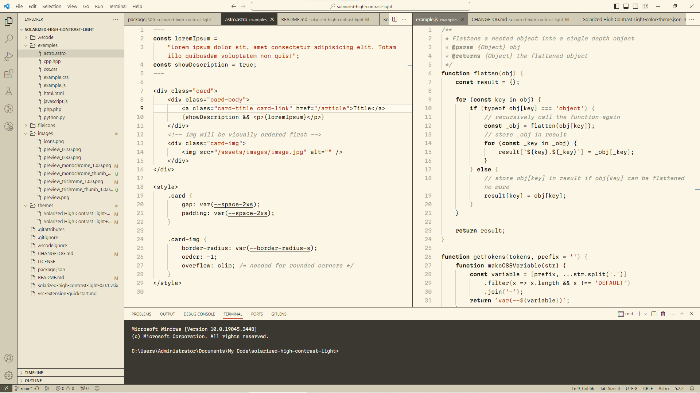
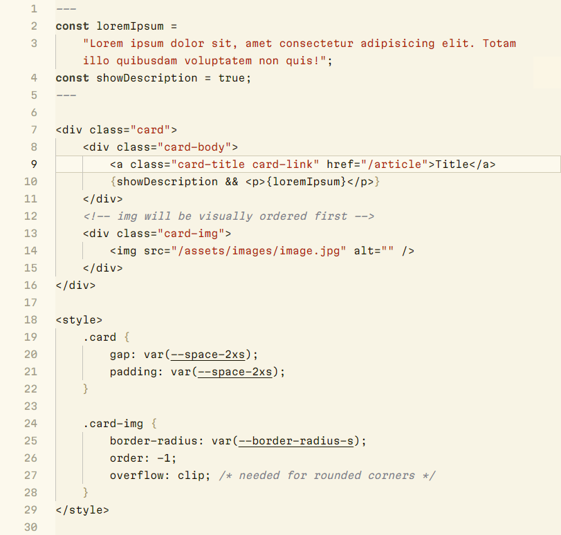
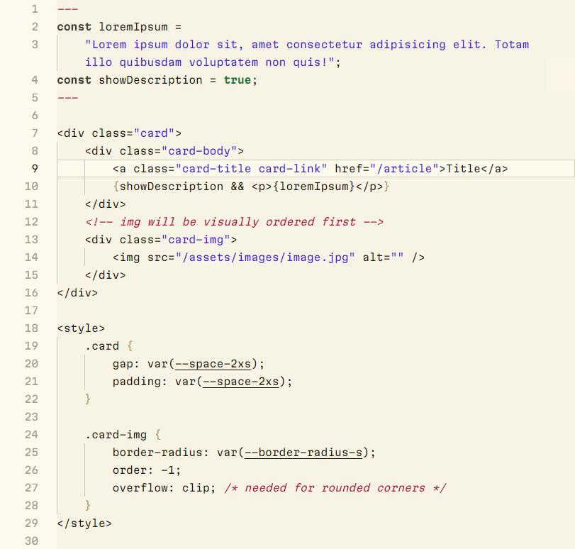

# Solarized High Contrast Light
High-contrast light theme for [Visual Studio Code](https://code.visualstudio.com/)

## Included Themes
### Solarized High Contrast Light
A monochrome palette with a single accent color for highlighting strings.

### Solarized High Contrast Light+ 
A three-color palette featuring distinct colors for strings, comments, and constants.

## Installation
1. Install theme from the [Marketplace](https://marketplace.visualstudio.com/items?itemName=tiny.solarized-high-contrast-light)
2. Navigate to File > Preferences > Color Theme > **Solarized High Contrast Light**

## Minimal File Icons

If you are using the **Minimal** file icons, the dark theme icon variants will be applied because the file icon theme API only provides one `highContrast` property associated with *both* high-contrast dark and high-contrast light themes.

A **High Contrast Minimal** file icon theme is included in this extension that enables support for high-contrast light themes.  
Navigate to File > Preferences > File Icon Theme > **High Contrast Minimal** to apply.